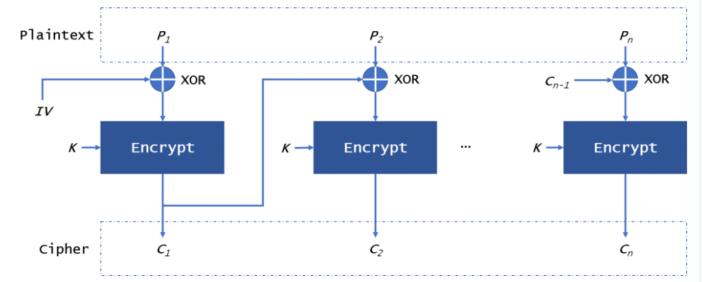
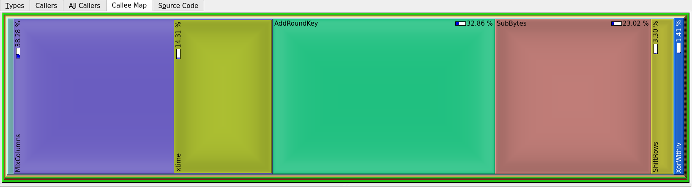
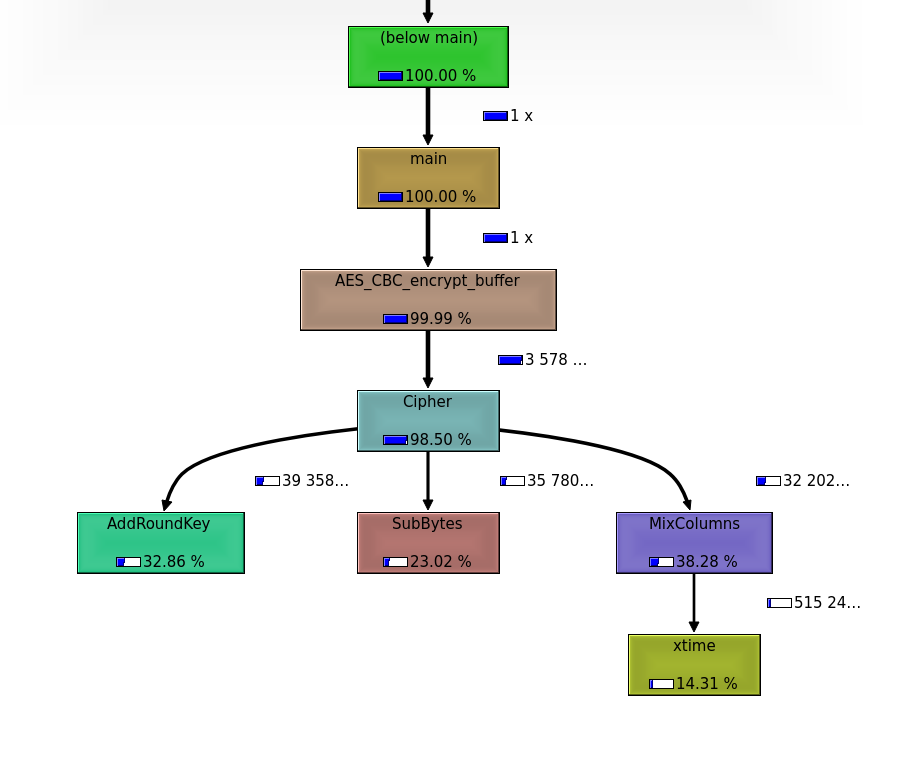

Original source code can be found at https://github.com/kokke/tiny-AES-c

# AES algorithm overview
The AES encryption algorithm is a symmetric block cipher. For our use case, we'll go with the 128 bit variant. The 128 bit variant works with 16 bit blocks, so if we want to encrypt more than that, we have to use one of the 5 modes of AES. We went with CBC mode, which uses an initialization vector (IV):

 

# Initial Profiling
For profiling we used KCachegrind. The executable needs to have debug info attached so first we compile the program without any optimizations, and with the `-g` flag by running `./debug.sh` from inside the scripts directory.

The callgrind file was obtained by running the following command:

`valgrind --tool=callgrind --collect-jumps=yes --dump-instr=yes --collect-systime=yes -- ../bin/aes`

By looking at the callee map we can observe the fact that some chained steps in the AES alogrithm like Mix Columns, xTime, Add Round Key or Substitute Bytes take approximately an equal amount of time.

The steps being chained one after the other is more visible on the call graph below:

NOTE:
 * For the purpose of this project, decryption is available to verify the implementation's accuracy. 

